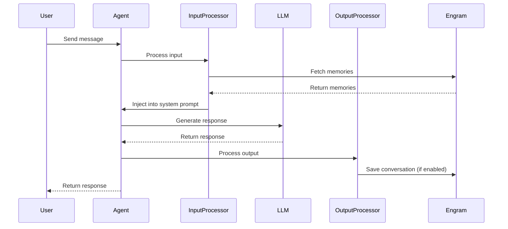

Integrate Engram with [Mastra](https://mastra.ai) to give your AI agents persistent memory. Use the `withEngram` wrapper for zero-config setup or processors for fine-grained control.

<Note>
  Migrating to v2 from 1.4.x? Check the [migration guide](/migration/tools-v2-upgrade).
</Note>

<Card title="@engram/tools on npm" icon="npm" href="https://www.npmjs.com/package/@engram/tools">
    Check out the NPM page for more details
</Card>

## Installation

```bash
npm install @engram/tools @mastra/core
```

## Quick Start

Wrap your agent config with `withEngram` to add memory capabilities:

```typescript
import { Agent } from "@mastra/core/agent"
import { withEngram } from "@engram/tools/mastra"
import { openai } from "@ai-sdk/openai"

// Create agent with memory-enhanced config
const agent = new Agent(withEngram(
  {
    id: "my-assistant",
    name: "My Assistant",
    model: openai("gpt-4o"),
    instructions: "You are a helpful assistant.",
  },
  {
    containerTag: "user-123",  // Required: scopes memories to this user
    customId: "conv-456",      // Required: groups messages for contextual memory
    mode: "full",
  }
))

const response = await agent.generate("What do you know about me?")
```

<Note>
  **Memory saving is enabled by default.** Conversations are automatically saved to Engram. To disable saving:

  ```typescript
  const agent = new Agent(withEngram(
    { id: "my-assistant", model: openai("gpt-4o"), ... },
    {
      containerTag: "user-123",
      customId: "conv-456",
      addMemory: "never",  // Disable automatic conversation saving
    }
  ))
  ```
</Note>

---

## How It Works

The Mastra integration uses Mastra's native [Processor](https://mastra.ai/docs/agents/processors) interface:

1. **Input Processor** - Fetches relevant memories from Engram and injects them into the system prompt before the LLM call
2. **Output Processor** - Optionally saves the conversation to Engram after generation completes



---

## Configuration Options

| Option | Type | Default | Description |
|--------|------|---------|-------------|
| `containerTag` | `string` | **Required** | User/container tag for scoping memories |
| `customId` | `string` | **Required** | Groups messages into a single document for contextual memory |
| `apiKey` | `string` | `ENGRAM_API_KEY` env | Your Engram API key |
| `baseUrl` | `string` | `https://api.engram.ai` | Custom API endpoint |
| `mode` | `"profile" \| "query" \| "full"` | `"profile"` | Memory search mode |
| `addMemory` | `"always" \| "never"` | `"always"` | Auto-save conversations |
| `verbose` | `boolean` | `false` | Enable debug logging |
| `promptTemplate` | `function` | - | Custom memory formatting |

---

## Memory Search Modes

**Profile Mode (Default)** - Retrieves the user's complete profile without query-based filtering:

```typescript
const agent = new Agent(withEngram(config, {
  containerTag: "user-123",
  customId: "conv-456",
  mode: "profile",
}))
```

**Query Mode** - Searches memories based on the user's message:

```typescript
const agent = new Agent(withEngram(config, {
  containerTag: "user-123",
  customId: "conv-456",
  mode: "query",
}))
```

**Full Mode** - Combines profile AND query-based search for maximum context:

```typescript
const agent = new Agent(withEngram(config, {
  containerTag: "user-123",
  customId: "conv-456",
  mode: "full",
}))

### Mode Comparison

| Mode | Description | Use Case |
|------|-------------|----------|
| `profile` | Static + dynamic user facts | General personalization |
| `query` | Semantic search on user message | Specific Q&A |
| `full` | Both profile and search | Chatbots, assistants |

---

## Saving Conversations

Conversation saving is enabled by default (`addMemory: "always"`). Messages are grouped using the required `customId`:

```typescript
const agent = new Agent(withEngram(
  { id: "my-assistant", model: openai("gpt-4o"), instructions: "..." },
  {
    containerTag: "user-123",
    customId: "conv-456",  // Required: groups messages for contextual memory
  }
))

// All messages in this conversation are saved automatically
await agent.generate("I prefer TypeScript over JavaScript")
await agent.generate("My favorite framework is Next.js")
```

To disable automatic saving:

```typescript
const agent = new Agent(withEngram(
  { id: "my-assistant", model: openai("gpt-4o"), instructions: "..." },
  {
    containerTag: "user-123",
    customId: "conv-456",
    addMemory: "never",  // Only retrieve memories, don't save
  }
))
```

---

## Custom Prompt Templates

Customize how memories are formatted and injected. The template receives `userMemories`, `generalSearchMemories`, and `searchResults` (raw array for filtering by metadata):

```typescript
import { Agent } from "@mastra/core/agent"
import { withEngram } from "@engram/tools/mastra"
import type { MemoryPromptData } from "@engram/tools/mastra"

const claudePrompt = (data: MemoryPromptData) => `
<context>
  <user_profile>
    ${data.userMemories}
  </user_profile>
  <relevant_memories>
    ${data.generalSearchMemories}
  </relevant_memories>
</context>
`.trim()

const agent = new Agent(withEngram(
  { id: "my-assistant", model: openai("gpt-4o"), instructions: "..." },
  {
    containerTag: "user-123",
    customId: "conv-456",
    mode: "full",
    promptTemplate: claudePrompt,
  }
))
```

---

## Direct Processor Usage

For advanced use cases, use processors directly instead of the wrapper:

### Input Processor Only

Inject memories without saving conversations:

```typescript
import { Agent } from "@mastra/core/agent"
import { createEngramProcessor } from "@engram/tools/mastra"
import { openai } from "@ai-sdk/openai"

const agent = new Agent({
  id: "my-assistant",
  name: "My Assistant",
  model: openai("gpt-4o"),
  inputProcessors: [
    createEngramProcessor({
      containerTag: "user-123",
      customId: "conv-456",
      mode: "full",
      addMemory: "never",
      verbose: true,
    }),
  ],
})
```

### Output Processor Only

Save conversations without memory injection:

```typescript
import { Agent } from "@mastra/core/agent"
import { createEngramOutputProcessor } from "@engram/tools/mastra"
import { openai } from "@ai-sdk/openai"

const agent = new Agent({
  id: "my-assistant",
  name: "My Assistant",
  model: openai("gpt-4o"),
  outputProcessors: [
    createEngramOutputProcessor({
      containerTag: "user-123",
      customId: "conv-456",
    }),
  ],
})
```

### Both Processors

Use the factory function for shared configuration:

```typescript
import { Agent } from "@mastra/core/agent"
import { createEngramProcessors } from "@engram/tools/mastra"
import { openai } from "@ai-sdk/openai"

const { input, output } = createEngramProcessors({
  containerTag: "user-123",
  customId: "conv-456",
  mode: "full",
  verbose: true,
})

const agent = new Agent({
  id: "my-assistant",
  name: "My Assistant",
  model: openai("gpt-4o"),
  inputProcessors: [input],
  outputProcessors: [output],
})
```

---

## Using RequestContext for Dynamic Thread IDs

For server setups where one agent instance handles multiple concurrent conversations, use Mastra's `RequestContext` to provide per-request thread IDs. **RequestContext takes precedence** over the construction-time `customId`:

```typescript
import { Agent } from "@mastra/core/agent"
import { RequestContext, MASTRA_THREAD_ID_KEY } from "@mastra/core/request-context"
import { withEngram } from "@engram/tools/mastra"
import { openai } from "@ai-sdk/openai"

const agent = new Agent(withEngram(
  { id: "my-assistant", model: openai("gpt-4o"), instructions: "..." },
  {
    containerTag: "user-123",
    customId: "fallback-conv",  // Used only when RequestContext doesn't provide a threadId
    mode: "full",
  }
))

// Per-request threadId takes precedence over customId
const ctx = new RequestContext()
ctx.set(MASTRA_THREAD_ID_KEY, "user-456-session-789")

await agent.generate("Hello!", { requestContext: ctx })
// This conversation is stored under "user-456-session-789", not "fallback-conv"
```

<Note>
  **Server-side usage**: Always use `RequestContext` to pass unique conversation IDs per request. Using a fixed `customId` for all requests will merge conversations from different users.
</Note>

---

## Verbose Logging

Enable detailed logging for debugging:

```typescript
const agent = new Agent(withEngram(
  { id: "my-assistant", model: openai("gpt-4o"), instructions: "..." },
  {
    containerTag: "user-123",
    customId: "conv-456",
    verbose: true,
  }
))

// Console output:
// [engram] Starting memory search { containerTag: "user-123", mode: "profile" }
// [engram] Found 5 memories
// [engram] Injected memories into system prompt { length: 1523 }
```

---

## Working with Existing Processors

The wrapper correctly merges with existing processors in the config:

```typescript
// Engram processors are merged correctly:
// - Input: [engram, myLogging] (engram runs first)
// - Output: [myAnalytics, engram] (engram runs last)
const agent = new Agent(withEngram(
  {
    id: "my-assistant",
    model: openai("gpt-4o"),
    inputProcessors: [myLoggingProcessor],
    outputProcessors: [myAnalyticsProcessor],
  },
  {
    containerTag: "user-123",
    customId: "conv-456",
  }
))
```

---

## API Reference

### `withEngram`

Enhances a Mastra agent config with memory capabilities.

```typescript
function withEngram<T extends AgentConfig>(
  config: T,
  options: EngramMastraOptions
): T
```

**Parameters:**
- `config` - The Mastra agent configuration object
- `options` - Configuration options (includes required `containerTag` and `customId`)

**Returns:** Enhanced config with Engram processors injected

### `createEngramProcessor`

Creates an input processor for memory injection.

```typescript
function createEngramProcessor(
  options: EngramMastraOptions
): EngramInputProcessor
```

### `createEngramOutputProcessor`

Creates an output processor for conversation saving.

```typescript
function createEngramOutputProcessor(
  options: EngramMastraOptions
): EngramOutputProcessor
```

### `createEngramProcessors`

Creates both processors with shared configuration.

```typescript
function createEngramProcessors(
  options: EngramMastraOptions
): {
  input: EngramInputProcessor
  output: EngramOutputProcessor
}
```

### `EngramMastraOptions`

```typescript
interface EngramMastraOptions {
  containerTag: string         // Required: User/container tag for scoping memories
  customId: string             // Required: Groups messages for contextual memory generation
  apiKey?: string
  baseUrl?: string
  mode?: "profile" | "query" | "full"
  addMemory?: "always" | "never"  // Default: "always"
  verbose?: boolean
  promptTemplate?: (data: MemoryPromptData) => string
}
```

---

## Environment Variables

```bash
ENGRAM_API_KEY=your_engram_key
```

---

## Error Handling

Processors gracefully handle errors without breaking the agent:

- **API errors** - Logged and skipped; agent continues without memories
- **Missing API key** - Throws immediately with helpful error message

```typescript
// Missing API key throws immediately
const agent = new Agent(withEngram(
  { id: "my-assistant", model: openai("gpt-4o"), instructions: "..." },
  {
    containerTag: "user-123",
    customId: "conv-456",
    apiKey: undefined,  // Will check ENGRAM_API_KEY env
  }
))
// Error: ENGRAM_API_KEY is not set
```

---

## Next Steps

<CardGroup cols={2}>
  <Card title="Vercel AI SDK" icon="triangle" href="/integrations/ai-sdk">
    Use with Vercel AI SDK for streamlined development
  </Card>

  <Card title="User Profiles" icon="user" href="/user-profiles">
    Learn about user profile management
  </Card>
</CardGroup>
