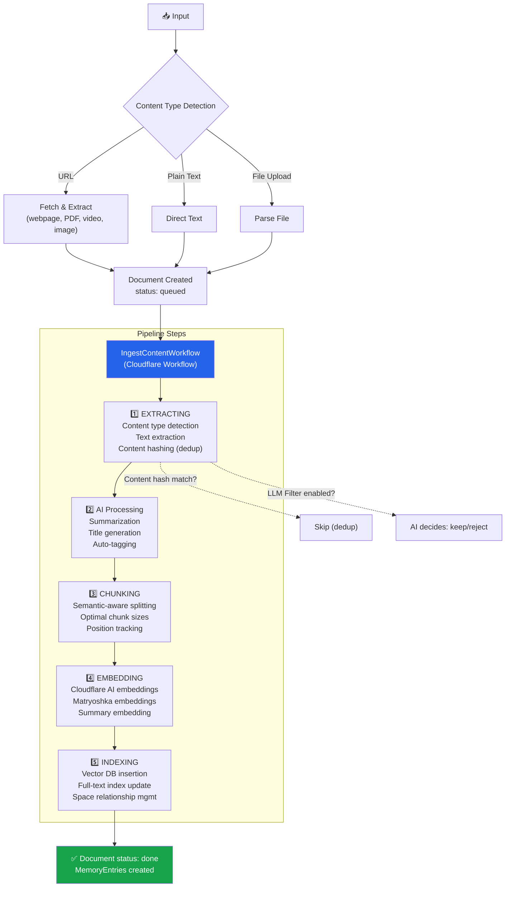
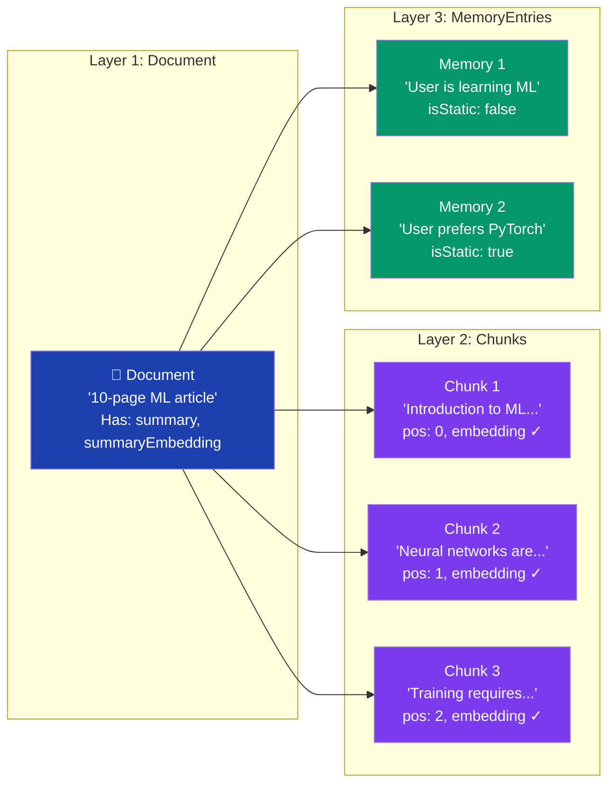
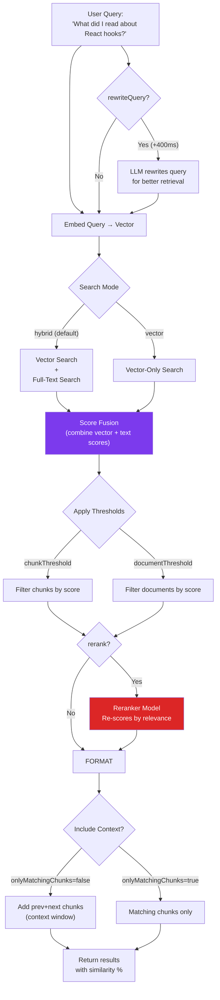
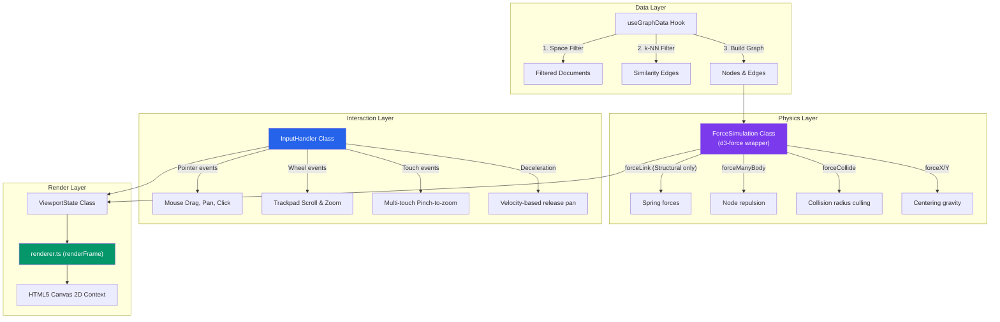
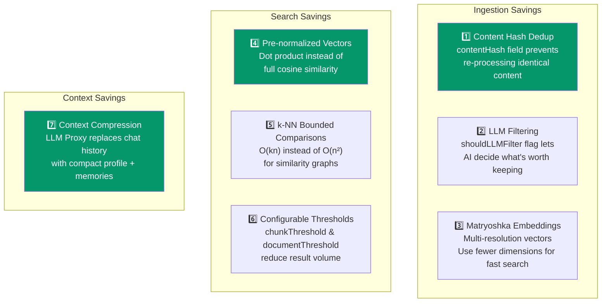
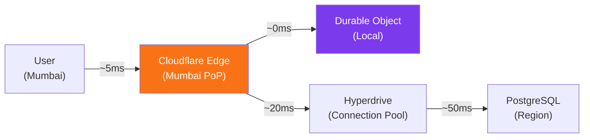
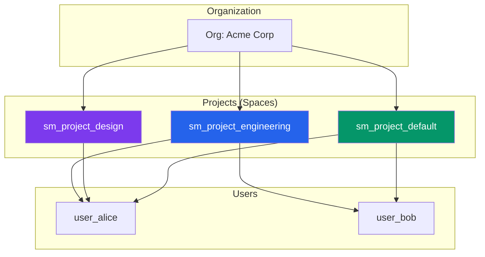
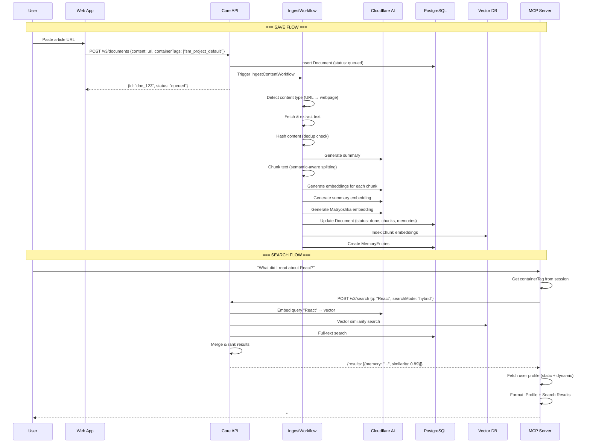
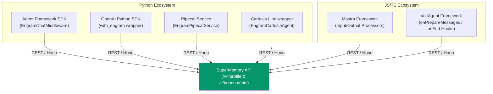

# SuperMemory: Deep System Design Documentation

> *How SuperMemory engineers human-like memory at scale — from a system designer's perspective*

---

## Table of Contents

1. [The 7 Pillars of Human-Like Memory](#1-the-7-pillars)
2. [Full Architecture Blueprint](#2-architecture)
3. [The Processing Pipeline (Encoding)](#3-processing-pipeline)
4. [The Search Pipeline (Recall)](#4-search-pipeline)
5. [The Memory Graph: Visualization of Thought](#5-memory-graph)
6. [Cost Efficiency Engineering](#6-cost-efficiency)
7. [Latency Optimization Strategies](#7-latency)
8. [Multi-Tenancy & Isolation](#8-multi-tenancy)
9. [Why It Wins Benchmarks](#9-benchmarks)
10. [Complete Data Flow: End to End](#10-data-flow)

---

## 1. The 7 Pillars of Human-Like Memory {#1-the-7-pillars}

SuperMemory doesn't just store text — it replicates seven cognitive functions that make human memory *intelligent*:

```mermaid
mindmap
  root["🧠 Human-Like Memory"]
    🔮 Structured Knowledge Extraction
      Documents → Chunks → Atomic Memories
      AI summarization during ingestion
      Entity extraction & auto-tagging
    🧲 Semantic Vector Space
      Every memory is a point in high-dimensional space
      Similar memories cluster naturally
      Pre-normalized embeddings for O(n) search
    🔗 Memory Versioning & Relations
      Facts evolve: v1→v2→v3 chains
      Three relation types: updates, extends, derives
      Root memory tracking
    🪞 User Profile / Self-Model
      Static facts: stable preferences
      Dynamic facts: recent activity
      Auto-injected into AI context
    🔍 Hybrid Search
      Vector similarity + full-text matching
      Configurable thresholds & reranking
      Query rewriting via LLM
    🧹 Smart Forgetting
      Semantic search → soft delete
      Time-based expiry via forgetAfter
      Forgotten memories excluded from search
    💉 Contextual Injection
      Profile injected as system prompt
      MCP tools auto-save new facts
      Positive feedback loop
```

### Why This Matters

| Pillar | Without It | With It |
|---|---|---|
| Structured Extraction | Raw text dump, keyword search only | Atomic facts, each independently searchable |
| Semantic Vectors | "React hooks" won't find "useState patterns" | Meaning-based retrieval across vocabulary |
| Versioning | "I live in NYC" conflicts with "I moved to SF" | Clean version history, latest always correct |
| Profile | Every conversation starts from scratch | AI knows your name, preferences, context |
| Hybrid Search | Miss exact matches OR miss semantic ones | Best of both worlds |
| Forgetting | Dead data pollutes results forever | Clean, relevant memory space |
| Context Injection | Manual copy-paste of preferences | Automatic, invisible personalization |

---

## 2. Full Architecture Blueprint {#2-architecture}

```mermaid
graph TB
    subgraph "Client Layer"
        subgraph "Applications"
            WEB["Web App<br/>(Next.js 15)"]
            EXT["Browser Extension<br/>(Chrome/Edge)"]
            RAY["Raycast Extension"]
        end
        
        subgraph "JS/TS SDKs & Integrations"
            SDK_JS["AI SDK<br/>(@engram/ai-sdk)"]
            MASTRA["Mastra Integration<br/>(@engram/tools/mastra)"]
            VOLT["VoltAgent Integration<br/>(@engram/tools/voltagent)"]
        end
        
        subgraph "Python SDKs & Integrations"
            SDK_PY["Python Client<br/>(engram)"]
            OPENAI_PY["OpenAI SDK Wrapper<br/>(engram-openai-sdk)"]
            MS_AGENT["MS Agent Framework SDK<br/>(engram-agent-framework)"]
            PIPECAT["Pipecat Voice SDK<br/>(engram-pipecat)"]
            CARTESIA["Cartesia Voice SDK<br/>(engram-cartesia)"]
        end
    end

    subgraph "Edge Layer (Cloudflare Workers)"
        MCP["MCP Server<br/>(Durable Object)"]
        PROXY["LLM Proxy<br/>(Infinite Chat)"]
        AUTH["Auth Gateway<br/>(OAuth + API Key)"]
    end

    subgraph "Core API (api.engram.ai)"
        API["Hono API Server"]
        INGEST["IngestContentWorkflow<br/>(Cloudflare Workflow)"]
        PROFILE["Profile Builder"]
        SEARCH["Hybrid Search Engine"]
    end

    subgraph "Intelligence Layer"
        AI["Cloudflare AI<br/>(Embeddings)"]
        LLM["LLM<br/>(Summarization, Tagging)"]
        RERANK["Reranker"]
    end

    subgraph "Storage Layer"
        PG["PostgreSQL<br/>(via Hyperdrive)"]
        VDB["Vector Database<br/>(Vectorize)"]
        KV["KV Storage<br/>(Cache / State)"]
    end

    WEB & EXT & RAY --> AUTH
    SDK_JS & MASTRA & VOLT --> AUTH
    SDK_PY & OPENAI_PY & MS_AGENT & PIPECAT & CARTESIA --> AUTH
    AUTH --> MCP & API
    MCP -.->|"Durable Object<br/>Session State"| KV
    SDK_JS & SDK_PY -.->|"Direct API"| API
    PROXY -->|"Intercepts"| LLM

    API --> INGEST
    API --> SEARCH
    API --> PROFILE
    
    INGEST --> AI
    INGEST --> LLM
    SEARCH --> VDB
    SEARCH --> PG
    SEARCH --> RERANK
    
    INGEST --> PG
    INGEST --> VDB
    PROFILE --> PG

    style MCP fill:#7c3aed,color:#fff
    style INGEST fill:#2563eb,color:#fff
    style SEARCH fill:#059669,color:#fff
    style VDB fill:#dc2626,color:#fff
```



### Key Architecture Decisions

| Decision | Rationale |
|---|---|
| **Cloudflare Workers at Edge** | Sub-50ms cold start, global distribution, no region lock-in |
| **Durable Objects for MCP** | Each user's MCP session is a stateful actor — stores `clientInfo`, caches `containerTags`, survives reconnections |
| **Hono over Express** | 10x smaller bundle, native Worker support, type-safe routing |
| **PostgreSQL via Hyperdrive** | Connection pooling for serverless (avoids connection exhaustion), prepared statement caching |
| **Separate Vector DB** | Can scale vector index independently of relational data |
| **LLM Proxy pattern** | Intercepts provider calls to inject context, track tokens, save costs — user never knows |
| **Framework-Agnostic SDK Wrappers** | Allows modular execution contexts in JS (Mastra, Voltagent) and Python (Microsoft Agent Framework, OpenAI, Pipecat, Cartesia Line), injecting memory seamlessly without modifying core agent scripts |

---

## 3. The Processing Pipeline (Encoding) {#3-processing-pipeline}

This is how raw content becomes searchable, structured memory:



### Processing Metadata Tracking

Every pipeline step is instrumented (from [schemas.ts](file:///c:/Users/Ayush/.gemini/antigravity/scratch/engram/packages/validation/schemas.ts)):

```typescript
ProcessingMetadata {
    startTime: number
    endTime: number
    duration: number
    chunkingStrategy: string   // Which chunker was used
    tokenCount: number         // Total tokens processed
    steps: [{
        name: string           // "extracting", "chunking", etc.
        startTime: number
        endTime: number
        status: "completed" | "failed" | "pending"
        error?: string
        metadata?: Record<string, unknown>
    }]
}
```

### Why Three Layers: Document → Chunk → MemoryEntry



| Layer | Purpose | Search Role |
|---|---|---|
| **Document** | Raw source material, the "whole article" | `summaryEmbedding` for document-level similarity |
| **Chunk** | Search-optimized fragments with context windows | Primary search target — `embedding` for vector search |
| **MemoryEntry** | Extracted atomic knowledge ("user likes X") | Profile building, version tracking, graph nodes |

> [!IMPORTANT]
> **Chunks serve search. Memories serve understanding.** A chunk is "paragraph 3 of the article." A memory is "user prefers dark mode." This separation is what makes recall smart — you search chunks for content, but track memories for identity.

---

## 4. The Search Pipeline (Recall) {#4-search-pipeline}

### 4.1. Hybrid Search Architecture

SuperMemory uses **three search modes** that can be combined:



### 4.2. The Cosine Similarity Optimization

From [similarity.ts](file:///c:/Users/Ayush/.gemini/antigravity/scratch/engram/packages/lib/similarity.ts) — the core math:

```typescript
// ALL embeddings are pre-normalized to unit vectors.
// This means cosine similarity = dot product.
// Dot product is O(n) with minimal operations — no division, no sqrt.

export const cosineSimilarity = (vectorA: number[], vectorB: number[]): number => {
    let dotProduct = 0;
    for (let i = 0; i < vectorA.length; i++) {
        dotProduct += vectorA[i] * vectorB[i];
    }
    return dotProduct; // That's it. No normalization needed.
}
```

**Why this matters for performance:**

| Full Cosine Similarity | SuperMemory's Dot Product |
|---|---|
| `dot(A,B) / (‖A‖ * ‖B‖)` | `dot(A,B)` |
| 3 passes over vectors | 1 pass over vectors |
| Requires magnitude calculation (sqrt) | No sqrt needed |
| ~3x more floating-point ops | Minimal operations |

The normalization happens **once at ingestion time**, not at every search query. This amortizes the cost across all future searches.

### 4.3. Search v4: Memory-Level Search with Context Chains

The v4 search returns **memories** (not just chunks) with their **evolutionary context**:

```typescript
MemorySearchResult {
    id: string
    memory: string                    // "Dhravya has filed the patent"
    similarity: number                // 0.89
    version: number                   // 3
    context: {
        parents: [{                   // Previous versions
            relation: "updates"
            version: -1               // Direct parent
            memory: "Dhravya is working on a patent"
        }]
        children: [{                  // Subsequent versions
            relation: "extends"
            version: +1
            memory: "The patent was approved by the board"
        }]
    }
    documents: [{ id, title, type }]  // Source documents
}
```

This is what makes search "smart" — you don't just get the matching memory, you get its **entire evolution chain** so the AI can understand how the fact developed over time.

---

## 5. The Memory Graph: Visualization of Thought {#5-memory-graph}

The Memory Graph isn't just a pretty visualization — it's a high-performance, interactive **physics simulation** of how memories and source documents relate to each other:

### 5.1. Architecture



The system is separated into logical, decoupled components:
- **`ForceSimulation`** (defined in [simulation.ts](file:///c:/Users/Ayush/.gemini/antigravity/scratch/engram/packages/memory-graph/src/canvas/simulation.ts)): Orchestrates the math running the force simulation.
- **`ViewportState`** (defined in [viewport.ts](file:///c:/Users/Ayush/.gemini/antigravity/scratch/engram/packages/memory-graph/src/canvas/viewport.ts)): Manages zoom factor, translation offsets, and coordinate transformations between screen and world coordinates.
- **`InputHandler`** (defined in [input-handler.ts](file:///c:/Users/Ayush/.gemini/antigravity/scratch/engram/packages/memory-graph/src/canvas/input-handler.ts)): Maps pointer and touch gestures to viewport actions.
- **`renderer.ts`** (defined in [renderer.ts](file:///c:/Users/Ayush/.gemini/antigravity/scratch/engram/packages/memory-graph/src/canvas/renderer.ts)): Renders frames using canvas drawing commands.

### 5.2. Force Configuration

From [constants.ts](file:///c:/Users/Ayush/.gemini/antigravity/scratch/engram/packages/memory-graph/src/constants.ts):

```typescript
FORCE_CONFIG = {
    linkStrength: {
        docMemory: 0.35,      // Spring strength between documents and derived memories
        version: 0.6,         // Spring strength along version update chains
        docDocBase: 0.0,      // Weak base attraction for similarity (disabled by default)
        fallback: 0.05,
    },
    linkDistance: 300,        // Natural spring distance for general links
    docMemoryDistance: 180,   // Target distance for derived memory orbits
    chargeStrength: -2000,    // High electro-static repulsion (prevents clutter)
    collisionRadius: { 
        document: 70, 
        memory: 35 
    },                        // Avoids overlapping nodes
    collisionStrength: 0.7,   // How rigid overlaps are corrected
    centeringStrength: 0.06,  // Pull toward coordinate origin
    alphaDecay: 0.025,        // Cool-down rate
    alphaMin: 0.001,          // Threshold below which simulation stops computing
    velocityDecay: 0.45,      // Physics friction (higher = less oscillation)
    alphaTarget: 0.3,         // Active movement target during drag interaction
    preSettleTicks: 150,      // Sync warm-up loops on initialization
}
```

> [!IMPORTANT]
> **Selective Physics Routing**: To prevent the entire knowledge base from collapsing into a single chaotic sphere of points, **`extends` relationship edges are completely excluded from the force simulation**. They are only drawn visually as dashed links. The simulation layout is determined strictly by structural links: `derives` (orbiting extracted content) and `updates` (linear version histories).

### 5.3. Smart Similarity Edge Generation (k-NN Bounded)

Instead of comparing every document to every other document ($O(n^2)$ complexity), SuperMemory bounds document similarity comparison using a bounded neighborhood search:

```typescript
// From use-graph-data.ts
const { maxComparisonsPerDoc, threshold } = SIMILARITY_CONFIG; // maxComparisonsPerDoc = 10, threshold = 0.725

for (let i = 0; i < documents.length; i++) {
    // Only compare with the next 10 documents in sequence
    const endIdx = Math.min(i + maxComparisonsPerDoc + 1, documents.length);
    
    for (let j = i + 1; j < endIdx; j++) {
        const sim = calculateSemanticSimilarity(docI.summaryEmbedding, docJ.summaryEmbedding);
        if (sim > threshold) { // Only create edge if above similarity threshold
            edges.push({
                id: `edge-${docI.id}-${docJ.id}`,
                source: docI.id,
                target: docJ.id,
                edgeType: "extends",
                color: colors.edgeExtends
            });
        }
    }
}
```

* **Performance impact**: Bounding matches to $k=10$ turns an $O(n^2)$ calculation into $O(kn)$. For $1,000$ documents, this reduces the similarity checks from $499,500$ down to $9,990$ (a **50x reduction**).

### 5.4. Luminous Aesthetics & Visual Decorators

The Memory Graph implements a modern dark-mode design system with specialized node and edge styling:

| Node/Edge Type | Visual Representation | Meaning & Behavior |
|---|---|---|
| **Document Node** | Rounded rectangles (`docFill` / `docStroke`) enclosing a central source-type icon (PDF, Web, Image, Video) | Ingested source document. Acts as a core cluster hub. |
| **Memory Node** | Regular hexagons (`memFill` / `memStrokeDefault`) | Extracted atomic fact. Orbits its parent source document. |
| **Superseded Memory** | Hexagon drawn at 50% opacity, dashed border, and a diagonal strikethrough line | A memory that has been updated by a newer version (`isLatest = false`). |
| **Forgotten Memory** | Border drawn in red (`memBorderForgotten = #EF4444`) with a bold "X" icon over the node | Soft-deleted memory. Still present in the graph but skipped during active search. |
| **Derives Edge** | Thin yellow lines (`edgeDerives = #FBBF24`), width 1.2px, 0.4 opacity | Denotes that a memory was extracted from a document. |
| **Updates Edge** | Bold purple/violet line (`edgeUpdates = #A78BFA`), width 2px, 0.7 opacity, with directed arrowheads | Denotes that a memory has been updated by another version. |
| **Extends Edge** | Sky Blue dashed lines (`edgeExtends = #38BDF8`), width 1.5px, 0.55 opacity | Denotes that two nodes share semantic similarities. |

* **Luminous Glow Pass**: During edge rendering, the canvas draws a wider, faint glow pass under every edge (40% opacity for updates, 30% for extends) before painting the core line. This creates a fluorescent, neon-like web effect.
* **Selection Halo**: Active/Selected nodes have a pulsating selection ring drawn around them, and non-connected nodes/edges fade out by setting their opacity to $1 - \text{dimProgress} \times 0.7$.

### 5.5. Renderer Performance Optimizations

To render hundreds of nodes and edges at 60 FPS, the canvas pipeline uses several critical optimization algorithms:

1. **Color-Based Batching (`groupByColor`)**: Changing Canvas stroke/fill configurations is expensive because it switches state inside the CPU/GPU pipeline. The renderer groups similar edges and nodes by their color property, building paths together, and executing a single `beginPath()`, multiple `moveTo`/`lineTo`/`arc`, and a single `stroke()` / `fill()` per batch.
2. **Viewport Culling**: Nodes and edges whose coordinates lie outside the screen bounds (with a safety margin of 100px) are culled before rendering.
3. **Detail Level Zoom Culling**: 
   * If the zoom factor is very low (zoom $< 0.08$), the renderer skips drawing visual `extends` (dashed) edges completely.
   * If a node's screen radius scales down below 8 pixels, it is rendered as a simple solid dot (using a shared path batch) rather than rendering complex rounded boxes, nested icons, hexagons, or text labels.
4. **Hex Color Lightening Cache**: To compute top-to-bottom node gradients, the renderer lightens the base node colors. Instead of parsing hex strings on every frame, the values are computed and saved in a module-level `lightenColor` cache.
5. **Pre-Settle Physics Ticks**: On initialization, the simulation runs 150 physics ticks synchronously (`preSettleTicks: 150`) within ~10ms. This prevents the user from seeing a chaotic, exploding cluster on load; instead, the graph appears instantly pre-settled and drifts smoothly into static equilibrium.

---

---

## 6. Cost Efficiency Engineering {#6-cost-efficiency}

### 6.1. Token Cost Tracking & Savings Analytics

SuperMemory tracks **exactly how much money it saves**:

```typescript
// From api.ts — Analytics schema
AnalyticsChatResponse {
    overview: {
        "7d" | "30d" | "90d" | "lifetime": {
            tokensProcessed: { current, previousPeriod }    // Total tokens in
            tokensSent: { current, previousPeriod }          // Tokens actually sent to LLM
            totalTokensSaved: { current, previousPeriod }    // Tokens NOT sent (saved!)
            amountSaved: { current, previousPeriod }         // Dollars saved
        }
    }
}
```

**How it saves tokens:** The LLM Proxy intercepts calls and **replaces long conversation history with compact memory summaries**. Instead of sending 50,000 tokens of chat history, it sends a 2,000-token profile + relevant memories.

### 6.2. The Seven Cost Optimization Strategies



| Strategy | Where | Savings |
|---|---|---|
| **Content Hash Dedup** | `Document.contentHash` | Prevents re-embedding identical content |
| **LLM Filtering** | `OrgSettings.shouldLLMFilter` | Rejects irrelevant content before expensive embedding |
| **Matryoshka Embeddings** | `Chunk.matryokshaEmbedding` | [MRL](https://arxiv.org/abs/2205.13147) — nested vectors work at 256 dims for fast search, expand to 1536 for precision |
| **Pre-normalized Vectors** | [similarity.ts](file:///c:/Users/Ayush/.gemini/antigravity/scratch/engram/packages/lib/similarity.ts) | 3x fewer FP ops per comparison |
| **k-NN Bounding** | [use-graph-data.ts](file:///c:/Users/Ayush/.gemini/antigravity/scratch/engram/packages/memory-graph/src/hooks/use-graph-data.ts) | 50x fewer comparisons for graph |
| **Configurable Thresholds** | `SearchRequestSchema` | Users control recall vs precision tradeoff |
| **Context Compression** | LLM Proxy | 10-25x token reduction in LLM calls |

### 6.3. Matryoshka Embeddings — The Multi-Resolution Trick

From [schemas.ts](file:///c:/Users/Ayush/.gemini/antigravity/scratch/engram/packages/validation/schemas.ts):

```typescript
ChunkSchema {
    embedding: z.array(z.number())               // Standard embedding (e.g., 1536-dim)
    embeddingNew: z.array(z.number())             // Migration to new model
    matryokshaEmbedding: z.array(z.number())      // Matryoshka embedding
}
```

**How Matryoshka works:**

```
Full embedding:  [0.12, -0.34, 0.56, ..., 0.78]  (1536 dimensions)
                  └────────────────────────────┘
                  Use first 256 dims for FAST approximate search
                  Use first 512 dims for BALANCED search
                  Use all 1536 dims for HIGH-PRECISION search
```

This lets SuperMemory do a **two-pass search**: fast approximate match with truncated vectors, then precise re-ranking with full vectors. Reduces vector DB compute by 3-6x.

### 6.4. Dual Model Migration

```typescript
// Old model embeddings preserved alongside new ones
embedding: vector          // Current model
embeddingNew: vector       // New model (during migration)
embeddingModel: string     // "text-embedding-ada-002"
embeddingNewModel: string  // "text-embedding-3-small"
```

This allows **zero-downtime model migration** — old and new embeddings coexist until migration is complete.

---

## 7. Latency Optimization Strategies {#7-latency}

### 7.1. Edge Computing Architecture



| Component | Latency Contribution | Why |
|---|---|---|
| **Cloudflare Workers** | < 5ms cold start | V8 isolates, not containers |
| **Durable Objects** | In-memory | MCP session state, no DB roundtrip |
| **Hyperdrive** | ~20ms savings | Prepared statement caching, connection pooling |
| **Vector DB** | ~50-100ms | Approximate nearest neighbor algorithms |

### 7.2. MCP Session State via Durable Objects

From [wrangler.jsonc](file:///c:/Users/Ayush/.gemini/antigravity/scratch/engram/apps/mcp/wrangler.jsonc):

```json
{
    "durable_objects": {
        "bindings": [{
            "name": "MCP_SERVER",
            "class_name": "EngramMCP"
        }]
    },
    "migrations": [{
        "tag": "v1",
        "new_sqlite_classes": ["EngramMCP"]
    }]
}
```

Each user gets a **dedicated Durable Object** that:
- Stores `clientInfo` (which AI tool is connected)
- Caches `containerTags` (available projects) — avoids API call on every request
- Uses **SQLite** for persistent state (survives Worker restarts)
- Lives at the **edge closest to the user**

### 7.3. Memory Graph: Quick-Settle Physics

From [use-force-simulation.ts](file:///c:/Users/Ayush/.gemini/antigravity/scratch/engram/packages/memory-graph/src/hooks/use-force-simulation.ts):

```typescript
// Quick pre-settle to avoid initial chaos, then animate the rest
simulation.alpha(1);
for (let i = 0; i < 50; ++i) simulation.tick(); // Just 50 ticks = ~5-10ms
simulation.alphaTarget(0).restart(); // Continue animating to full stability
```

**Why this is clever:** Instead of showing the user chaotic node movement on load, it runs **50 simulation ticks synchronously** (~5-10ms) to pre-settle the layout, then lets the remaining settling animate smoothly. Users see a nearly-stable graph instantly.

### 7.4. API Client: Retry with Linear Backoff

```typescript
export const $fetch = createFetch({
    baseURL: "https://api.engram.ai/v3",
    retry: {
        attempts: 3,
        delay: 100,     // 100ms, 200ms, 300ms
        type: "linear",
    },
});
```

Linear backoff (not exponential) is deliberate — for a user-facing product, you want **fast retries** since most failures are transient network blips, not sustained overload.

---

## 8. Multi-Tenancy & Isolation {#8-multi-tenancy}

### Container Tags: The Isolation Primitive



Every memory is tagged with `containerTags` — an array of strings that scope it:

```
containerTags: ["sm_project_engineering", "user_alice"]
```

**Search is always scoped by container tag.** This ensures:
- User A's memories never appear in User B's searches
- Project-scoped search only returns memories tagged for that project
- Cross-project search is possible by querying multiple tags

---

## 9. Why It Wins Benchmarks {#9-benchmarks}

### The Architecture Patterns That Excel

| Benchmark Dimension | SuperMemory's Advantage |
|---|---|
| **Recall Accuracy** | Hybrid search (vector + full-text) catches both semantic and exact matches |
| **Latency** | Edge deployment + Durable Objects + Hyperdrive = sub-100ms p95 |
| **Context Quality** | Profile system (`static` + `dynamic` facts) gives AI persistent context, not just search results |
| **Cost Efficiency** | Token compression via LLM Proxy, Matryoshka embeddings for multi-resolution search |
| **Scalability** | Container tag isolation → horizontal scaling per tenant, no cross-contamination |
| **Memory Evolution** | Version chains with `updates`/`extends`/`derives` — the system knows when facts change |
| **Forgetting** | Smart semantic deletion prevents stale data from polluting results |

### The Feedback Loop That Compounds Quality


This is the entire competitive moat. Most memory systems are **linear** (save → search). SuperMemory is **circular** — every interaction makes future interactions better.

---

## 10. Complete Data Flow: End to End {#10-data-flow}

### Scenario: User saves an article, then searches for it later



---

## 11. SDKs & Agent Framework Integrations {#11-integrations}

To allow developers to drop memory capabilities into existing agent setups without rewriting core agent instructions, SuperMemory provides plug-and-play middleware wrappers across major Javascript and Python ecosystems.



### 11.1. Python SDK & Wrappers

#### 1. Microsoft Agent Framework SDK (`engram-agent-framework`)
Designed for Microsoft's agent orchestrator. It supports two primary integration models:
* **Automatic Chat Middleware (`EngramChatMiddleware`)**: Injects memories into the message stream before LLM invocation and saves transcripts back to SuperMemory.
* **Context Provider (`EngramContextProvider`)**: Integrates directly with the `AgentSession` pipeline, behaving like built-in Mem0 providers to fetch profile state.

#### 2. OpenAI SDK Wrapper (`engram-openai-sdk`)
A wrapper (`with_engram`) that intercepts chat completion calls transparently.
* **Background Task Queue**: Prevents slow write operations from blocking chatbot responses by offloading document creation to a background thread.
* **Lifecycle Management**: Implemented as an async context manager or exposing `wait_for_background_tasks()` to block on exit and guarantee no memory writes are lost.
* **Event Loop Isolation**: Automatically spawns background worker threads if invoked from within active event loops to avoid nested `asyncio` loop errors.

#### 3. Pipecat SDK (`engram-pipecat`)
A custom pipeline stage (`EngramPipecatService`) that fits into voice agent audio streaming workflows.
* Intercepts `LLMContextFrame` packages to inject memories.
* Maintains clean conversation transcripts (excluding injected context metadata) so that subsequent database saves do not double-index the retrieved memories.

#### 4. Cartesia SDK (`engram-cartesia`)
A voice agent wrapper (`EngramCartesiaAgent`) for Cartesia Line.
* Hooks into the event-driven system by listening for `UserTurnEnded` events.
* Appends profile/query memories to `event.history` as a system prompt.
* Commits transcription events asynchronously to preserve spoken conversations.

---

### 11.2. JavaScript / TypeScript Integrations

#### 1. Mastra Framework (`@engram/tools/mastra`)
Mastra's agent instances utilize private properties that cannot be edited after construction. SuperMemory integrates by wrapping the `AgentConfig` before instantiation:
* **`EngramInputProcessor`**: Intercepts prompt inputs and runs semantic query matches and profile fetches before the agent executes.
* **`EngramOutputProcessor`**: Saves conversation logs to SuperMemory after the model responds.

#### 2. VoltAgent (`@engram/tools/voltagent`)
VoltAgent utilizes hook arrays for execution hooks. The `withEngram` helper merges lifecycle listeners into the config:
* **`onPrepareMessages`**: Fetches memories matching the query, structures them using a custom `promptTemplate`, and prepends them to the system prompt.
* **`onEnd`**: Saves conversation turns to SuperMemory. It supports advanced features like `entityContext` (providing explicit background context for semantic indexing).

---

> [!TIP]
> **The core lesson from SuperMemory's architecture: Memory is not a feature — it's a system.** You can't bolt on "memory" to an AI agent by adding a database. You need structured extraction, semantic indexing, version tracking, profile building, hybrid search, smart forgetting, and context injection — all working together in a feedback loop. That's what makes it feel "human."

